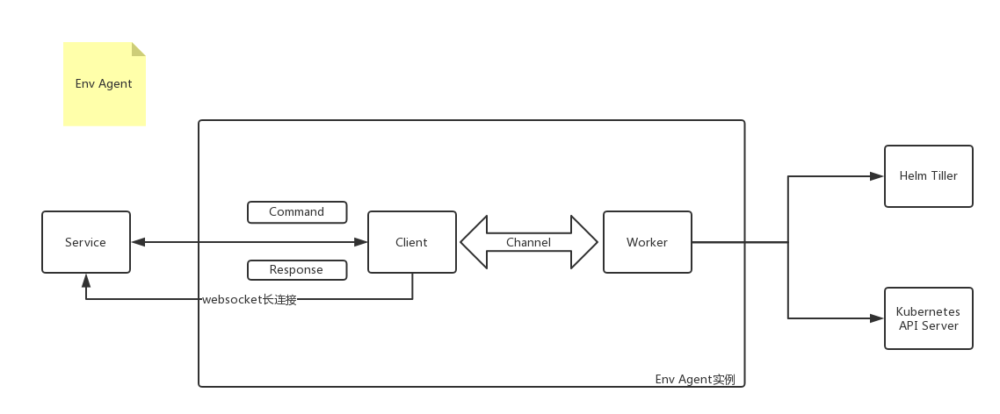

# Choerodon cluster Agent

[![GoDoc Widget]][GoDoc]

`Choerodon Agent` is a environment client which connects to the choerodon platform through websocket, And it is a relay station for other services and k8s interaction. The interactioninteract through `command/response` to provide these features to other service,such as management of helm release, network management, k8s object monitoring, and container log and shell. We can use che choerodon agent to operate the k8s like using kubectl client.



## Feature

- [x] helm release management
- [x] Web Services and Domain Management
- [x] Kubernetes object monitoring and processing
- [x] Container log and shell
- [x] WebSocket log of k8s object

## Requirements

- Go 1.11.5 and above

## Installation and Run

Get Code

```bash
go get github.com/choerodon/choerodon-cluster-agent
cd `go env GOPATH`/src/github.com/choerodon/choerodon-cluster-agent/
```

Build

```bash
make
```

Run

```bash
SERVER_ADDRESS=wss://your.devops.domain/agent/?version=your-agent-version&clusterId=your-cluster-id&token=your-token&key=cluster:your-cluster-id
Token=your-token
./bin/choerodon-cluster-agent \
    --v=1 \
    --tiller-connection-timeout=2 \
    --connect=${SERVER_ADDRESS} \
    --token=${Token} 
```

## Reporting Issues
If you find any shortcomings or bugs, please describe them in the [issue](https://github.com/choerodon/choerodon/issues/new?template=issue_template.md).

## How to Contribute
Pull requests are welcome! [Follow](https://github.com/choerodon/choerodon/blob/master/CONTRIBUTING.md) to know for more information on how to contribute.

[GoDoc]: https://godoc.org/github.com/choerodon/choerodon-cluster-agent
[GoDoc Widget]: https://godoc.org/github.com/choerodon/choerodon-cluster-agent?status.svg